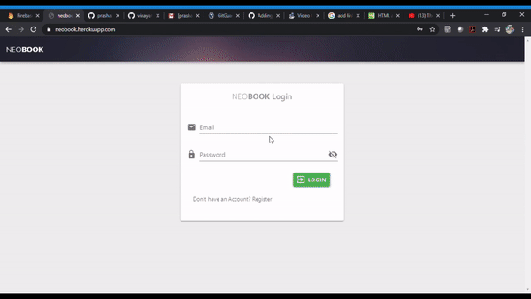

# vuetify_project

A social media WebApp built using Vue.js for frontend and firebase for backend database. Users can post content, share posts, chat, comment, like etc.

## Project setup
```
npm install
```

### Compiles and hot-reloads for development
```
npm run serve
```

### Compiles and minifies for production
```
npm run build
```

<a href="https://neobook.herokuapp.com">Link for this WebApp</a>


